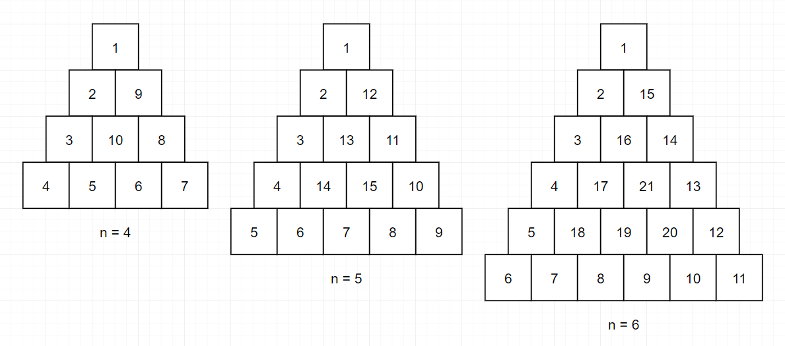

# [Programmers] 삼각 달팽이

프로그래머스(Programmers) :  https://programmers.co.kr/learn/courses/30/lessons/68645

### 문제

정수 n이 매개변수로 주어집니다. 다음 그림과 같이 밑변의 길이와 높이가 n인 삼각형에서 맨 위 꼭짓점부터 반시계 방향으로 달팽이 채우기를 진행한 후, 첫 행부터 마지막 행까지 모두 순서대로 합친 새로운 배열을 return 하도록 solution 함수를 완성해주세요.



### 제한사항

- n은 1 이상 1,000 이하입니다.

#### 예제 입력 1

```  
4
5
6
```  

#### 예제 출력 1

```  
[1,2,9,3,10,8,4,5,6,7]
[1,2,12,3,13,11,4,14,15,10,5,6,7,8,9]
[1,2,15,3,16,14,4,17,21,13,5,18,19,20,12,6,7,8,9,10,11]
```  

### 입출력 예 설명

입출력 예 #1

문제 예시와 같습니다.

입출력 예 #2

문제 예시와 같습니다.

입출력 예 #3

문제 예시와 같습니다.

## 2. 내 소스 코드

```python  
def solution(n):
    boxes = [[] for _ in range(n)]
    v = 1
    d = 0
    while n > 0:
        if d % 3 == 0:
            for i in range(n):
                boxes[2 * (d//3) + i].insert(d//3, v)
                v += 1

        elif d % 3 == 1:
            tmp = []
            for _ in range(n):
                tmp.append(v)
                v += 1

            for _ in range(n):
                boxes[-1 - (d//3)].insert(1+(d//3), tmp.pop())

        else:
            for i in range(n):
                if d == 2:
                    boxes[-2 - (d//3) - i].append(v)
                else:
                    boxes[-2 - (d//3) - i].insert(-(d//3), v)
                v += 1
        d += 1
        n -= 1
    answer = []
    for box in boxes:
        answer += box
    return answer
```  


## 3. 풀이 & 개선점