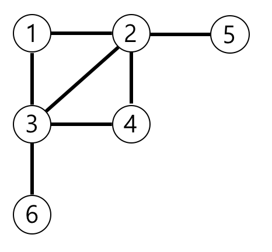

# [Programmers] 가장 먼 노드

프로그래머스(Programmers) :  https://programmers.co.kr/learn/courses/30/lessons/49189

### 문제

n개의 노드가 있는 그래프가 있습니다. 각 노드는 1부터 n까지 번호가 적혀있습니다. 1번 노드에서 가장 멀리 떨어진 노드의 갯수를 구하려고 합니다. 가장 멀리 떨어진 노드란 최단경로로 이동했을 때 간선의 개수가 가장 많은 노드들을 의미합니다.

노드의 개수 n, 간선에 대한 정보가 담긴 2차원 배열 vertex가 매개변수로 주어질 때, 1번 노드로부터 가장 멀리 떨어진 노드가 몇 개인지를 return 하도록 solution 함수를 작성해주세요.

### 제한사항

- 노드의 개수 n은 2 이상 20,000 이하입니다.
- 간선은 양방향이며 총 1개 이상 50,000개 이하의 간선이 있습니다.
- vertex 배열 각 행 [a, b]는 a번 노드와 b번 노드 사이에 간선이 있다는 의미입니다.

#### 예제 입력 1

```  
6	[[3, 6], [4, 3], [3, 2], [1, 3], [1, 2], [2, 4], [5, 2]]
```  

#### 예제 출력 1

```  
3
```  

### 입출력 예 설명

예제의 그래프를 표현하면 아래 그림과 같고, 1번 노드에서 가장 멀리 떨어진 노드는 4,5,6번 노드입니다.



## 2. 내 소스 코드

```python  
from collections import deque

def solution(n, edge):
    answer = 0
    
    graph = [[] for _ in range(n+1)]
    visited = [False] * (n+1)
    
    for i, j in edge:
        graph[i].append(j)
        graph[j].append(i)

    queue = deque()
    queue.append((1, 0))
    visited[1] = True
    final_depth = 0
    
    while queue:
        node, depth = queue.popleft()
        depth += 1
        
        for i in graph[node]:
            if not visited[i]:
                visited[i] = True
                queue.append((i, depth))
                
                if depth > final_depth:
                    answer = 1
                    final_depth = depth
                elif depth == final_depth:
                    answer += 1
                      
    return answer
```  


## 3. 풀이 & 개선점