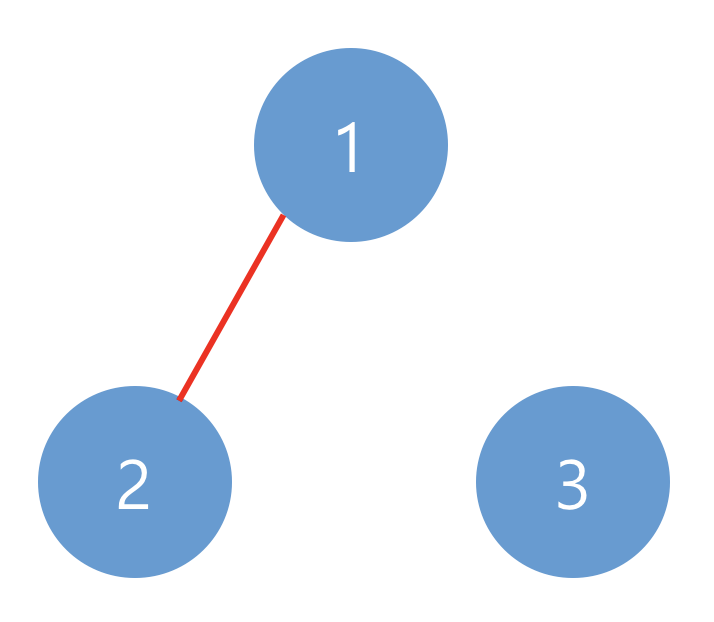
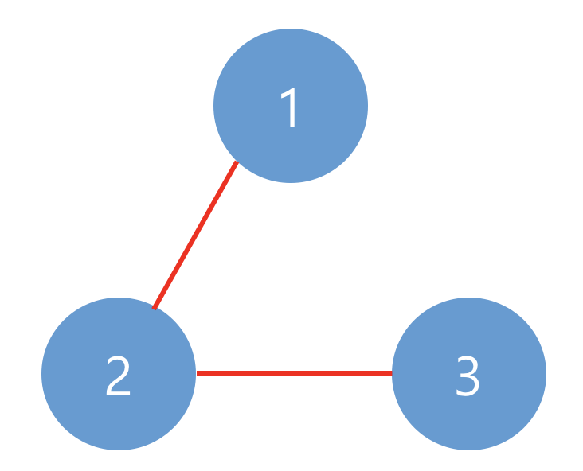

# [Programmers] 네트워크

프로그래머스(Programmers) :  https://programmers.co.kr/learn/courses/30/lessons/43162

### 문제

네트워크란 컴퓨터 상호 간에 정보를 교환할 수 있도록 연결된 형태를 의미합니다. 예를 들어, 컴퓨터 A와 컴퓨터 B가 직접적으로 연결되어있고, 컴퓨터 B와 컴퓨터 C가 직접적으로 연결되어 있을 때 컴퓨터 A와 컴퓨터 C도 간접적으로 연결되어 정보를 교환할 수 있습니다. 따라서 컴퓨터 A, B, C는 모두 같은 네트워크 상에 있다고 할 수 있습니다.

컴퓨터의 개수 n, 연결에 대한 정보가 담긴 2차원 배열 computers가 매개변수로 주어질 때, 네트워크의 개수를 return 하도록 solution 함수를 작성하시오.

### 제한사항

- 컴퓨터의 개수 n은 1 이상 200 이하인 자연수입니다.
- 각 컴퓨터는 0부터 n-1인 정수로 표현합니다.
- i번 컴퓨터와 j번 컴퓨터가 연결되어 있으면 computers[i][j]를 1로 표현합니다.
- computer[i][i]는 항상 1입니다.

#### 예제 입력 1

```  
3	[[1, 1, 0], [1, 1, 0], [0, 0, 1]]
3	[[1, 1, 0], [1, 1, 1], [0, 1, 1]]
```  

#### 예제 출력 1

```  
2
1
```  

### 입출력 예 설명

예제 #1

아래와 같이 2개의 네트워크가 있습니다.



예제 #2

아래와 같이 1개의 네트워크가 있습니다.



## 2. 내 소스 코드

```python  
from collections import deque

def bfs(v, graph, visited):
    queue = deque()
    queue.append(v)
    visited[v] = True

    while queue:
        v = queue.popleft()

        for i, con in enumerate(graph[v]):
            if not visited[i] and i != v and con == 1:
                queue.append(i)
                visited[i] = True

def solution(n, computers):
    answer = 0
    visited = [False] * n

    for i in range(n):
        for j in range(n):
            if i != j and computers[i][j] == 1:
                if not visited[i]:
                    answer += 1
                    visited[i] = True
                    bfs(j, computers, visited)

    answer += visited.count(False)

    return answer
```  


## 3. 풀이 & 개선점