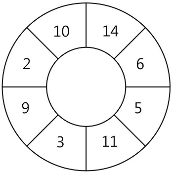

# [Programmers] 스티커 모으기(2)

프로그래머스(Programmers) :  https://programmers.co.kr/learn/courses/30/lessons/12971

### 문제

N개의 스티커가 원형으로 연결되어 있습니다. 다음 그림은 N = 8인 경우의 예시입니다.



원형으로 연결된 스티커에서 몇 장의 스티커를 뜯어내어 뜯어낸 스티커에 적힌 숫자의 합이 최대가 되도록 하고 싶습니다. 단 스티커 한 장을 뜯어내면 양쪽으로 인접해있는 스티커는 찢어져서 사용할 수 없게 됩니다.

예를 들어 위 그림에서 14가 적힌 스티커를 뜯으면 인접해있는 10, 6이 적힌 스티커는 사용할 수 없습니다. 스티커에 적힌 숫자가 배열 형태로 주어질 때, 스티커를 뜯어내어 얻을 수 있는 숫자의 합의 최댓값을 return 하는 solution 함수를 완성해 주세요. 원형의 스티커 모양을 위해 배열의 첫 번째 원소와 마지막 원소가 서로 연결되어 있다고 간주합니다.

### 제한사항

- sticker는 원형으로 연결된 스티커의 각 칸에 적힌 숫자가 순서대로 들어있는 배열로, 길이(N)는 1 이상 100,000 이하입니다.
- sticker의 각 원소는 스티커의 각 칸에 적힌 숫자이며, 각 칸에 적힌 숫자는 1 이상 100 이하의 자연수입니다.
- 원형의 스티커 모양을 위해 sticker 배열의 첫 번째 원소와 마지막 원소가 서로 연결되어있다고 간주합니다.

#### 예제 입력 1

```  
[14, 6, 5, 11, 3, 9, 2, 10]
[1, 3, 2, 5, 4]
```  

#### 예제 출력 1

```  
36
8
```  

### 입출력 예 설명

입출력 예 #1

6, 11, 9, 10이 적힌 스티커를 떼어 냈을 때 36으로 최대가 됩니다.

입출력 예 #2

3, 5가 적힌 스티커를 떼어 냈을 때 8로 최대가 됩니다.

## 2. 내 소스 코드

```python  
def solution(sticker):
    answer = 0

    if len(sticker) == 1:
        return sticker[0]
    
    # case 맨 앞의 스티커를 뜯어내는 것과 아닌 것으로 구분
    # 1. 맨 앞의 스티커 제거
    dp_1 = [0 for _ in range(len(sticker))]
    dp_1[0] = sticker[0]
    dp_1[1] = dp_1[0]
    for i in range(2, len(sticker)-1):
        dp_1[i] = max(dp_1[i-2]+sticker[i], dp_1[i-1])
    res_1 = max(dp_1)
    
    # 2. 맨 앞의 스티커 제거 x
    dp_2 = [0 for _ in range(len(sticker))]
    dp_2[0] = 0
    dp_2[1] = sticker[1]
    for i in range(2, len(sticker)):
        dp_2[i] = max(dp_2[i-2]+sticker[i], dp_2[i-1])
    
    res_2 = max(dp_2)
    answer = max(res_1, res_2)

    return answer
```  


## 3. 풀이 & 개선점